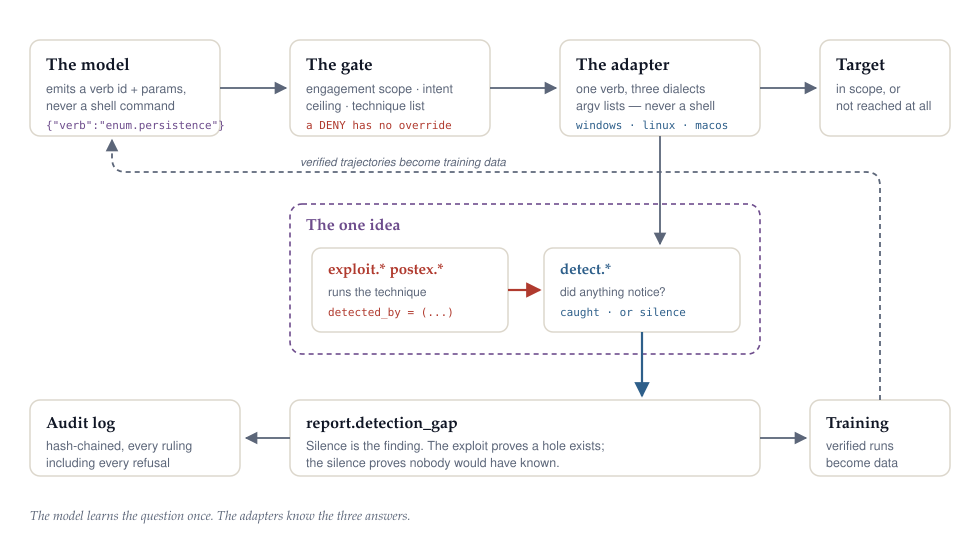

<p align="center">
  
  
</p>

<p align="center">
  <a href="https://github.com/at0m-b0mb/Whetstone/actions/workflows/ci.yml"></a>
  <a href="LICENSE"></a>
  
  
  
  
  
</p>

---

A whetstone does not cut anything. It exists so the blade does its job better, and
it is useless on its own. That is the argument for the red half of this project:
**the attack side is here to sharpen the defence**, and nothing in it is built to be
pointed at someone who has not asked for it.

Whetstone is two things that depend on each other in one direction only. A
**purple-team agent runtime** that enumerates a machine, proves its weaknesses by
exploiting them, and then asks whether anything noticed — and a **small language
model pretrained from scratch**, not fine-tuned from someone else's weights, to
drive it.

<p align="center">
  
</p>

---

## The one idea

Every offensive verb declares the detection that should catch it.

```python
_v(
    id="postex.credential_dump",
    intent=Intent.EXECUTE,
    side=Side.RED,
    attck=("T1003",),
    detected_by=("detect.credential_access",),   # this
)
```

The agent runs the attack, then runs the detection, then compares. **Caught** is a
control working. **Silence** is a detection gap — a finding that names the
technique, the host, and the telemetry that was missing.

This is not documentation. It is a schema field the constructor enforces: a red
verb declaring no `detected_by` raises at import. If the honest answer is that
nothing covers a technique, you write `detect.nothing` and it appears in
`whet coverage` as a gap on the blue backlog. Silence by omission is not available.

> **The exploit is not the deliverable. The gap it reveals is.**

"There is a hole" gets triaged into next quarter. "There is a hole, and nobody
would have known" gets fixed on Monday.

It is also the cleanest training signal in the system. *Did rule X fire within N
seconds of technique Y?* is a mechanically checkable fact, not a judge model's
opinion — so trajectories get labelled correct or incorrect with no human in the
loop.

---

## It runs real commands

30 of the 32 catalogue verbs are implemented on **Windows, Linux and macOS**. The
two without adapters are `report.*`, which reach nothing and correctly need none.

Live on the development machine, through the real gate:

```
enum.host        macOS 26.7, build 25G229, Darwin 25.6.0 arm64      57 ms
enum.privileges  uid 501, is_admin true, real group membership      65 ms
detect.telemetry process_creation_auditing: FALSE                   15 s
                 "macOS has no process-creation auditing comparable to Sysmon"
```

That last line is the thesis working. The adapter did not merely enumerate — it
reported honestly that this machine **cannot see process creation**. A detection
gap on the local host, found in fifteen seconds, with no attack run at all.

| group | side | what it does |
|---|---|---|
| `enum.*` (9) | neutral | Look at the machine — the substrate both sides share |
| `vuln.*` (4) | neutral | Turn observations into findings. Still observe-only |
| `exploit.*` (3) | red | Prove the finding is real by using it |
| `postex.*` (5) | red | Credentials, persistence, escalation, lateral movement |
| `detect.*` (6) | blue | Ask whether anything noticed |
| `harden.*` (3) | blue | Fix what the exercise proved was broken |

---

## See it run

The agent loop chains these verbs, and after every red action runs the detection
that should catch it — silence becomes a finding. The trained model drives the
loop under constrained decoding, so every action it emits is valid by
construction.

**[`examples/runs/`](examples/runs/) holds real, captured runs** — the 14.6M
model driving the loop against a sandbox and against a live Ubuntu VM, with the
observations exactly as the adapters returned them. On the VM, auditd was running
with no rules loaded, so the model's binary-overwrite went unseen:

```
### 9. exploit.service_permissions(...) on 127.0.0.1 — ok
### 10. detect.process_creation(...) on 127.0.0.1 — ok
FINDING 🔴 DETECTION GAP  T1574.010
        exploit.service_permissions ran and detect.process_creation did not fire
        — the technique succeeded unobserved
```

Each run is captured three ways: a human transcript that shows what the model
chose *over*, a machine-readable findings file, and the wire-protocol trajectory
that doubles as a training example. Reproduce with `python -m lab.run --both
--model <checkpoint>` or, against the real VM, `python -m lab.vm.run --model
<checkpoint>`.

---

## Autonomy and authorisation are different axes

The usual objection to a gate is that it makes the agent stop and ask permission.
It does not. It defines the walls inside which it never has to.

```yaml
authorize:
  red_team: true
  max_intent: execute
  techniques: [T1547, T1053, T1003, T1574.010]
  unattended: [observe, modify, execute]   # the autonomy dial
```

With `execute` in `unattended`, the agent enumerates, finds the weakness, exploits
it, escalates, pivots and reports **without pausing once**. That axis is fully open.
What it still cannot do is touch a host nobody authorised — and that is what makes
the tool deployable at all.

```console
$ whet -e engagement.yaml plan exploit.scheduled_task 10.20.4.77
ALLOW   exploit.scheduled_task(as_user=SYSTEM, cleanup=True) on 10.20.4.77
        rule: intent.unattended
        after this runs, the agent checks: detect.persistence_change, detect.process_creation

$ whet -e engagement.yaml plan exploit.scheduled_task 10.20.4.50
DENY    exploit.scheduled_task(as_user=SYSTEM, cleanup=True) on 10.20.4.50
        rule: scope.host.excluded
        10.20.4.50 is explicitly excluded by the rule '10.20.4.50'.
```

**A denial has no override.** No `force=`, no `--yes-really`, anywhere — asserted
mechanically across the public API by a test. Exclusions beat any range that would
cover them, the policy fallthrough is *confirm* rather than *allow*, and a
confirmation with no human attached resolves to a refusal.

The gate is a pure function of `(engagement, verb, action, clock)` — no files, no
sockets, no commands — so the entire safety surface tests in 50 ms with no lab, no
VM and no target.

---

## No shell, ever

`run()` takes an argument list and has **no `shell` parameter at all**, so no caller
can enable one. Model-supplied parameters reach `execve` as single argv entries and
are never parsed as syntax. Command injection is removed as a category rather than
mitigated, and the exact argv of every command is recorded for the audit log.

That property was tested the hard way. Windows is the only platform that hands a
*script body* to an interpreter, and three sites spliced a model-supplied service
name into it:

```python
f'Get-CimInstance Win32_Service -Filter "Name=\'{service}\'"'
```

The argv boundary does not help there. PowerShell parses the whole `-Command`
string as source, and because that is a **double-quoted** literal, `$(...)` expands
before `Get-CimInstance` is ever reached — a service named
`$(Start-Process calc.exe)` would run. All three sites were in red `EXECUTE` verbs.

The repair interpolates nothing at all: the full service list is fetched with a
constant script and the row matched in Python. The one remaining spliced value is
*asserted* to be a literal column list, so a future caller threading a parameter
through fails loudly rather than quietly reopening the hole.

---

## About "from scratch"

A genuine from-random-init pretrain. The staircase is **15M to 60M to 150M**,
because nobody should debug a training pipeline on a multi-day run.

**Measured on an M4 Pro / 24 GB**, not estimated:

| model | params | tokens | epochs | wall-clock |
|---|---:|---:|---:|---:|
| `tiny` | 14.6M | 0.29B | 2.1 | **0.2 d** |
| `small` | 61.5M | 1.23B | 8.9 | 2.2 d |
| `base` | 151.0M | 3.02B | 21.9 | 7.8 d |

bfloat16 is not an optimisation here, it is the project: in fp32 at ctx 2048 the
base model peaks at 18.7 GB on a 24 GB machine, which means swap — and a run that
has started swapping is not slow, it is finished.

### What it learned

From random initialisation, 14.6M parameters, **500 steps**:

```
CVE-2024-0637
published: 2017-11-11T11:29:08.717
cvss: 9.3 HIGH
vector: CVSS:3.0/AV:N/AC:L/PR:N/UI:N/S:U/C:H/I:H/A:H
weakness: CWE-787
```

Every CVSS metric present, in the correct order, with legal values. `CWE-787` is a
real identifier. The model learned the **schema** of a vulnerability record.

Validation perplexity over that run: **626 → 90 → 37.8 → 11.6**.

### What the benchmark says

`bench/whetbench.py` measures capabilities that are mechanically checkable, and
reports them per probe. It deliberately produces no single score: these probes
measure unrelated things, and an average would imply a grade where what matters is
*which* capability appeared first.

At 14.6M parameters, step 3,000:

| probe | result | what a pass demonstrates |
|---|:--:|---|
| `shell-routing` | **5/5** | stays in the shell register when prompted in it |
| `detection-routing` | **5/5** | continues a detection rule as a detection rule |
| `cwe-shape` | **5/5** | real weakness ids, contextually apt (CWE-89, CWE-352) |
| `cvss-vector` | 2/5 | a grammatically valid CVSS v3 vector |
| `cve-shape` | 0/5 | emitting a CVE id unprompted by one |
| `attck-real` | 0/5 | ATT&CK ids that *exist*, not ids that look right |
| `action-json` | **0/5** | **the task: emit an action the registry accepts** |

The last row is the honest headline. The model cannot emit a valid action — and
that is not a mystery, it is arithmetic: **the corpus contains zero trajectory
data.** The TRAJECTORY register sits at 0.00% by design. It has learned the
*language* of security and has never once seen the *job*. That gap closes with the
agent loop and SFT on verified runs, not with more pretraining.

`shell-routing` is the counter-example that shows the method works. An earlier
checkpoint answered CVE records to a `Get-Process` prompt because advisory text
outweighed shell text twelve to one. Adding one targeted source moved it to 5/5.

### The four levers

| lever | why it matters |
|---|---|
| **Domain tokenizer** | **+29% over gpt2** on held-out text, every register winning |
| **Closed action space** | Picking one of ~200 verb ids is classification, not free generation |
| **Retrieval for facts** | The model never memorises a CVE or an ATT&CK description |
| **Adapters for syntax** | Concepts live in weights; dialects live in code |

The tokenizer lever was the one in doubt, and measurement settled it. Fitted to
~10 MB of the author's own repositories it beat gpt2 by only **7%** — and the
per-sample breakdown said why: netstat output +47% and registry paths +36% where
the corpus had the register, but ATT&CK ids **-45%** and CVE ids **-26%** where it
did not. A tokenizer can only learn merges for text it has met.

Rebuilt across all six registers and re-measured on **held-out** text:

| register | chars | vs gpt2 |
|---|---:|---:|
| system | 211,545 | **+40%** |
| prose | 74,607 | +33% |
| advisory | 114,626 | **+30%** |
| detection | 186,835 | +30% |
| shell | 384,678 | +22% |
| adversary | 129,950 | **+13%** |
| **total** | **1,102,241** | **+29%** |

Both registers that previously *lost* to gpt2 now win.

---

## The corpus

**138M tokens, 466M characters, 206,245 documents, 13 sources** — every one
declaring an upstream licence the build refuses to run without.

| source | register | side | licence |
|---|---|---|---|
| `rfc` | system | | IETF Trust (BCP 78) |
| `kerneldocs` | system | | GPL-2.0 WITH Linux-syscall-note |
| `manpages` | system | | mixed, per-page (local only) |
| `nvd` | advisory | | public domain (NIST) |
| `atomic` | shell | red | MIT |
| `psdocs` | shell | | CC BY 4.0 / MIT |
| `tldr` | shell | | MIT / CC BY 4.0 |
| `sigma` | detection | blue | DRL-1.1 |
| `splunk` | detection | blue | Apache-2.0 |
| `attack` | adversary | red | MITRE ATT&CK Terms of Use |
| `attackactors` | adversary | red | MITRE ATT&CK Terms of Use |
| `capec` | adversary | red | MITRE CAPEC Terms of Use |
| `owasp` | prose | blue | CC-BY-SA-4.0 |
| `ownrepos` | prose | | MIT |

Every document carries a `Register` and a `Side`, and every build prints observed
share against target — because the first corpus was starved of entire registers and
nothing said so until four steps downstream in a token count.

That report has earned its place. It caught `ownrepos` following the repository's
`data` symlink into the external SSD and copying 180 MB of the corpus cache back
in, relabelled as prose — **the corpus eating itself** — by showing prose at 82%
against a 10% target.

---

## Try it

```bash
git clone https://github.com/at0m-b0mb/Whetstone && cd Whetstone

python3 -m whetstone.cli verbs --side red      # what it can do
python3 -m whetstone.cli coverage              # which attacks nothing would notice
python3 -m whetstone.cli -e examples/engagement.yaml check
python3 -m whetstone.cli -e examples/engagement.yaml plan postex.credential_dump 10.20.4.77
```

Training, on a machine with MLX:

```bash
pip install -e ".[train,dev]"
python3 -m training.corpus.build --max-source-share 0.25
python3 -m training.tokenizer.train_tokenizer --clean data/corpus/clean-balanced
python3 -m training.pretrain --model tiny
python3 -m bench.whetbench --checkpoint data/models/checkpoints/tiny \
    --tokenizer data/models/tokenizer/tokenizer.json
```

---

## Status

| | component | where |
|---|---|---|
| done | Action schema, verb catalogue, detection pairing | `whetstone/actions.py`, `verbs.py` |
| done | The gate — engagement, policy, hash-chained audit | `whetstone/gate/` |
| done | Platform adapters, 30 verbs x 3 OSes | `whetstone/adapters/` |
| done | Corpus — 13 sources, register balance, provenance | `training/corpus/` |
| done | Tokenizer, model, pretraining, generation | `training/` |
| done | Benchmark with mechanical checks | `bench/` |
| todo | Agent loop — chain verbs, self-correct, report gaps | `whetstone/kernel/` |
| todo | Trajectory corpus + SFT — the `action-json` gap | `training/` |
| todo | MCP + HTTP surfaces | `whetstone/surfaces/` |

**Known gaps, stated plainly.** The corpus register mix is still skewed: advisory
and system over target, shell and adversary under. And there is no trajectory data
at all, which is exactly why `action-json` scores 0/5. `small` and `base` should
not run until both are corrected, because a larger model on this mix becomes a
better CVE-record generator rather than a purple-team agent.

---

## Scope of use

Whetstone runs against systems you are authorised to test, and the engagement
document is where that authorisation is written down. It is not covert, it does not
hide itself, and every decision it makes — including every refusal — lands in a
hash-chained log an operator can hand to whoever asks.

MIT licensed. *The stone cuts nothing. That is the point.*
